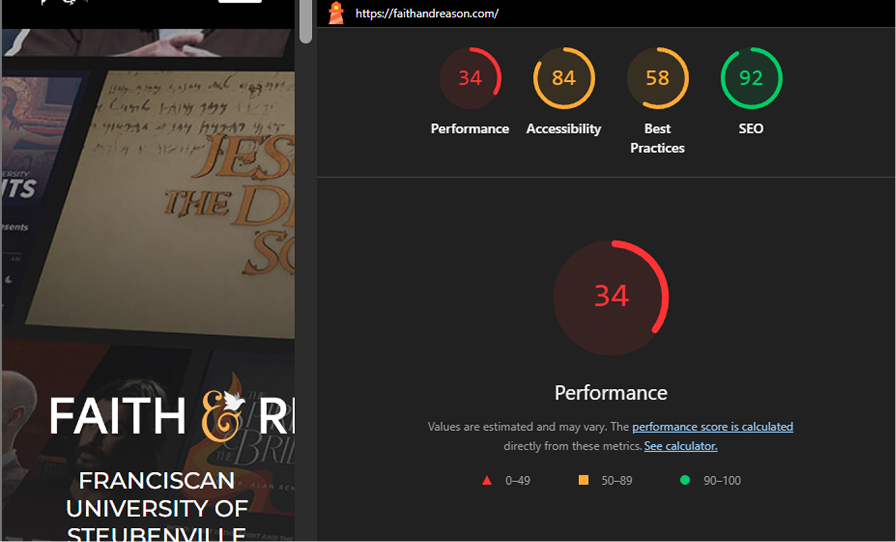
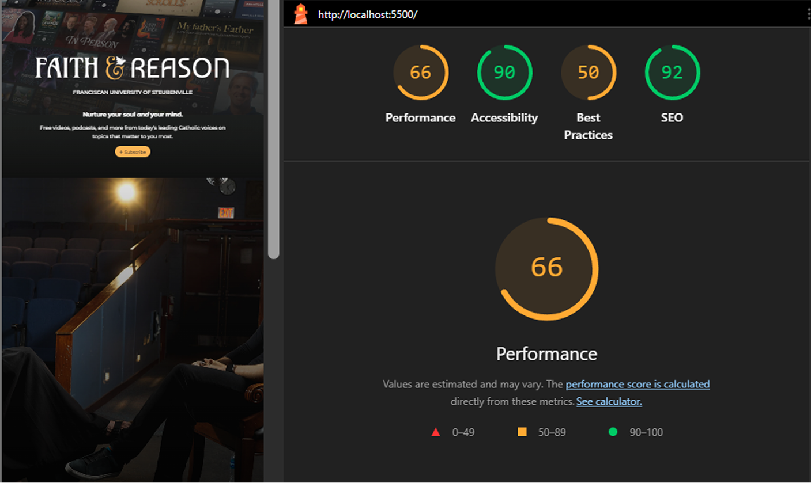

# Faith and Reason Landing Page Redesign

Frontend performance, accessibility, and UX facelift fro the Faith & Reason landing page.

This project has taken the original implementation and makes improvements to the **performance, maintainability, accessibility, and WordPress integration readiness** of the website. All the while, the visual identity of Franciscan is respected and maintained.

___

## Project Overview

The project aims at evaluating and improving upon the technical and visual execution of the Faith & Reason landing page. It focuses on a few critical areas:
- Frontend performance
- Accessibility (ADA/WCAG alignment)
- WordPress-ready code architecture

The original page was analyzed using **Google Lighthouse**, and improvements were done directly in the HTML, CSS, and JavaScript.

## Lighthouse Benchmark Comparison
### Original Site Audit



Major issues detected included:
- High Total Blocking Time (~1950 ms)
- Large network payload (~13.5 MB)
- Missing alt attributes
- Render blocking scripts
- Excessive JavaScript execution
- Accessibility labeling gaps

___

### Redesigned Implementation



Key improvements included:
- Total Blocking Time reduced from ~1950 ms → ~130 ms
- Largest Contentful Paint improved from 8.7s → 4.5s
- Accessibility increased from 84 → 90

___

## Engineering Improvements

### Performance Optimization

#### Head Optimization

Several changes were made to meta tags, scripts, and links to ensure the browser parses correctly and the page renders quickly.

#### DOCTYPE Delcaration

Added HTML5 DOCTYPE declaration to avoid browsers entering Quirks Mode.

#### Viewport Configuration
Updated:
```
scale="1"
```
to:
```
initial-scale=1.0
```
for responsive behavior across mobile devices.

___

### Connection Priming

Moved `preconnect` declarations to the top of the document to allow the browser to establish early connections to those critical external resources.

**Effect**: reduced DNS lookup and TLS handshake latency.

___

### Script Deferring

All non-critical scripts were marked with `defer`.

Benefits:
- Prevented blocking HTML parsing
- Improved First Contentful Paint
- Reduced Total Blocking Time

___

### DOM Execution Control

Custom scripts were wrapped in a DOMContentLoaded listener so they execute only after the DOM is fully parsed.

**Effect**: prevented render-blocking behavior and improves main-thread availability.

___

### Image Optimization

Images were converted to WebP format.

Benefits:
- Smaller file sizes
- Faster decoding
- Reduced network payload


___

### CSS Optimization

Stylesheets were minified and reorganized to reduce unused rules and improve browser parsing efficiency.

## Accessibility Improvements (ADA)


Accessibility was a primary focus of this redesign.

Several structural improvements were implemented to improve usability for assistive technologies.

___

### ARIA Landmarks

Semantic landmarks were introduced to provide navigational structure for screen readers.

Examples include:
- `header`
- `nav`
- `main`
- `section`

ARIA labels were added where appropriate to provide contextual meaning.

___

### Skip Navigation Link

A Skip to Content link was added to support keyboard navigation.

This allows users relying on keyboards or screen readers to bypass repetitive navigation elements.

___

### Semantic Layout

Structural semantics were improved using proper HTML5 elements:
- `header`
- `nav`
- `main`
- `section`

This improved both accessibility and SEO.

___

### Image Accessibility

All images were updated with descriptive alt attributes.

This ensures compatibility with screen readers and improves search indexing.


___

## UI Improvements

Beyond technical improvements, the project also included UI redesign concepts created in Figma.

The redesign focuses on:
- clearer visual hierarchy
- improved typography
- better mobile layout structure
- stronger call-to-action placement
- improved readability

These design explorations demonstrate how the site could evolve visually while remaining consistent with the branding of Franciscan University of Steubenville.

| Original Page UI | Redesigned UI |
|---------|---------|
|  |  |

___

## Tech 
- HTML5
- CSS3
- JavaScript
- WebP Image Optimization
- Google Lighthouse
- Figma (UI redesign exploration)

___

## Lessons

This project demonstrates how targeted frontend improvements can significantly enhance user experience without requiring a complete platform rebuild.

**Key takeaways:**
- Performance issues are often caused by render-blocking scripts and large asset payloads.
- Accessibility improvements frequently come from semantic structure rather than complex tooling.
- WordPress themes benefit greatly from clean, modular HTML structure.

___

## Future Improvements

Future improvements should include:
- Lazy loading images
- Server-side caching
- CSS critical path extraction
- Gutenberg block components
- Content Security Policy implementation

___ 

## Author
**Jose Quiceno**
Frontend Developer